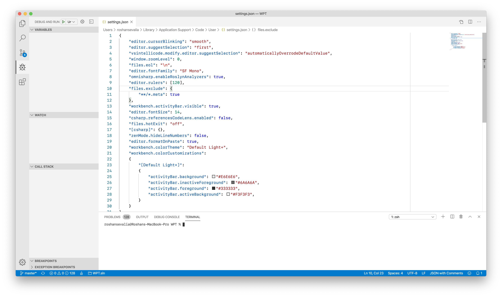

# Update
VSCode has fixed their light theme with the new Modern Light theme that I'm personally a fan of. I am now using that theme and archiving this.
# VSCode-Light-Fixed
Fixes the horrible black sidebar on VSCode's light theme and makes comments less green and annoying. This also has small customizations on the dark theme to maintain some more consistency if you like auto-switching themes.

# How to add to VSCode
Copy the contents of the settings.json file from this repository and paste them into the VSCode settings.json file
